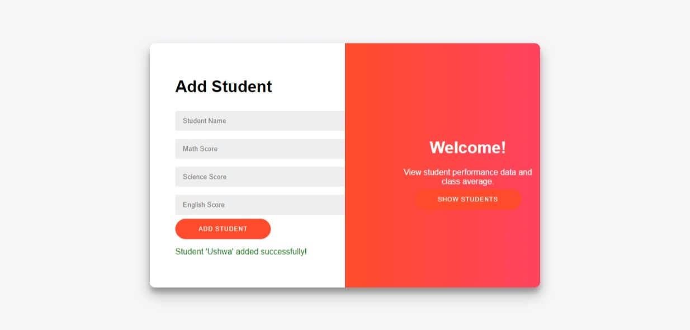
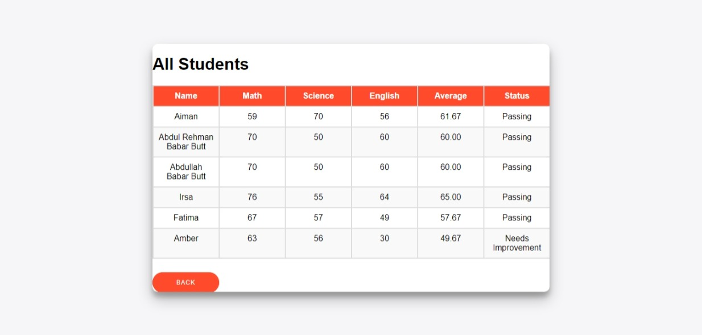

# Student Performance Tracker

This project is a Python and Flask-based system to manage and track student grades using Object-Oriented Programming concepts. It calculates averages, checks if students are passing, and provides performance feedback. It also includes a web interface for adding students, displaying performance data, and exporting results to an Excel file.

## How to Use:

1. **Clone the Repository**: Clone this repository to your local machine.
2. **Install Requirements**: Install Flask and Pandas (for data handling) .
3. **Run the Application**:
   - Start the Flask server with `app.py`.
   - Access the application on your local server at `http://127.0.0.1:5000/`.
4. **Adding Students**: Enter student names and their scores for Math, Science, and English subjects. The application will store the data, calculate averages, and provide feedback on each student’s performance.
5. **View Performance**: You can view individual and class performance, check if students are passing, and export data to an Excel file.

## Files:

- **`app.py`**: The main Python script containing the Flask server and backend logic for managing students, calculating averages, and exporting data.
- **Templates and Static Files**:
  - **HTML**: Contains forms and performance tables.
  - **CSS**: Styling for the user interface.
  - **JavaScript**: Manages button interactions and form behavior.
  - **Excel Export**: Saves student performance data as `students_performance.xlsx`.

## Requirements:

- Python 3.x
- Flask (`pip install Flask`)
- Pandas (`pip install pandas`)
- Openpyxl (`pip install openpyxl`)

## Installation:

1. Clone the repository:
   ```bash
   git clone https://github.com/your_username/Student_Performance_Tracker.git
   
## Example Screenshots

Here are some example screenshots of the application in action:

### Add Student Page


### Performance Summary



